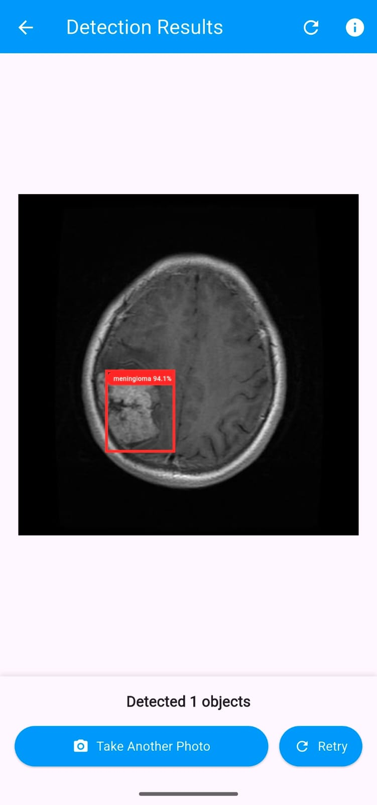
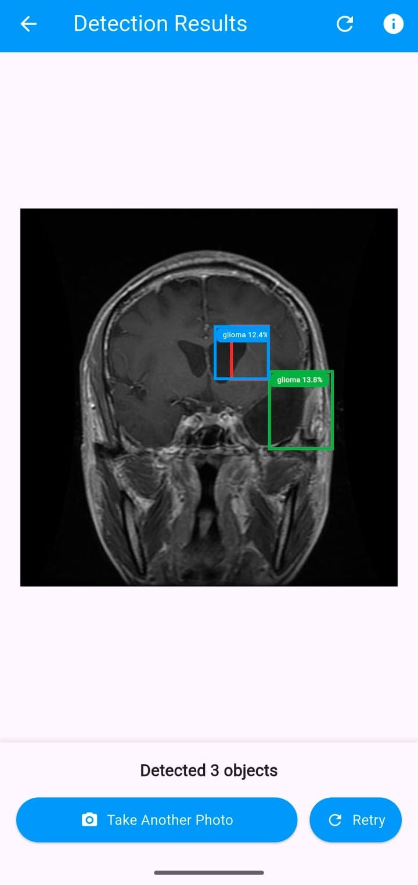

# 🧠 Brain Tumor detection using YOLO

Detect brain tumors in MRI images using the state-of-the-art YOLO (You Only Look Once) object detection algorithm. This project applies deep learning to assist in early and accurate diagnosis of brain tumors, enhancing radiological analysis and medical imaging workflows.

## 🚀 Features

-   🔍 Real-time object detection of brain tumors in MRI scans
-   🧠 Pre-trained YOLO model fine-tuned on brain tumor datasets
-   📊 Model evaluation metrics: Confusion Matrix, Precision, Recall
-   🖼️ Bounding box visualization on test images

## 📸 Screenshots

## ⚙️ Tech Stack

-   📘 Flutter
-   🎯 Dart
-   🎁 Provider
-   📷 Image Picker
-   📨 Dio

 

-   🐍 Python
-   ⚗️ Flask

 

-   👁️ YOLO v11
-   🔥 Ultralytics
-   🤖 Roboflow

## 🤝 Contributing

Contributions are welcome! Open an issue or submit a pull request for features, bugs, or improvements.

## 📫 Stay in touch

-   Author - [Naman Arora](https://namanarora.vercel.app)
-   Twitter - [@naman_22a](https://twitter.com/naman_22a)

## 🗒️ License

Brain Tumor Detection using YOLO is [GPL V3](./LICENSE)
